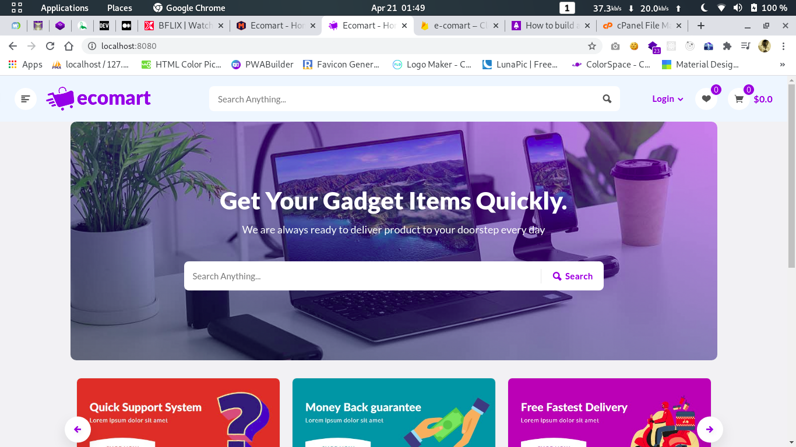
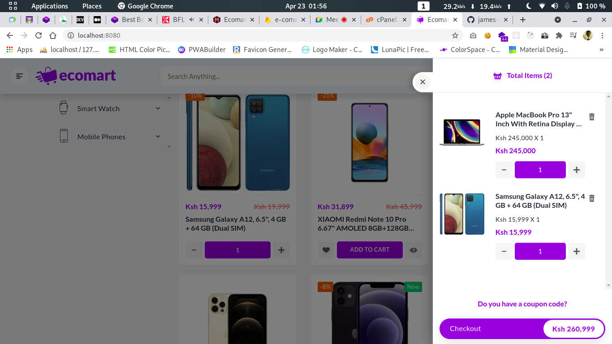
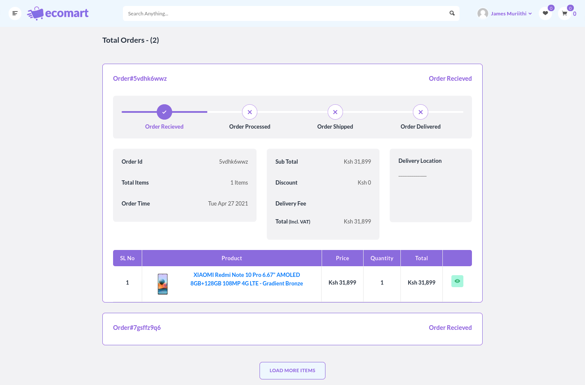

# E-comart





I decided to do this project for learning purposes after completing a <a href="https://www.udemy.com/course/vuejs-2-the-complete-guide/">vuejs course</a> on Udemy by Maximilian Schwarzmüller.

## Project setup

```
npm install
```

### Compiles and hot-reloads for development

```
npm run serve
```

### Compiles and minifies for production

```
npm run build
```

### Lints and fixes files

```
npm run lint
```

### Todo

1. Auth (Login and signup) ✔️
1. Product quick view (modal) ✔️
1. Product details page ✔️
1. Cart ✔️
1. Fetch data from firestore ✔️
1. Wishlist ✔️
1. Checkout ✔️
1. Order page ✔️
1. User profile page
1. Search products
1. Browse with product subcategories
1. Deploy to firebase ✔️
1. Dark mode
1. Similar products
1. Lazy load images
1. PWA ✔️
